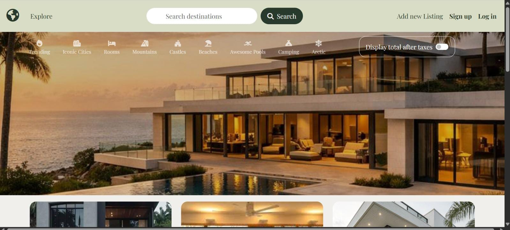
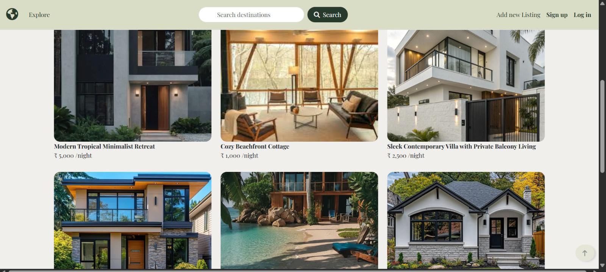
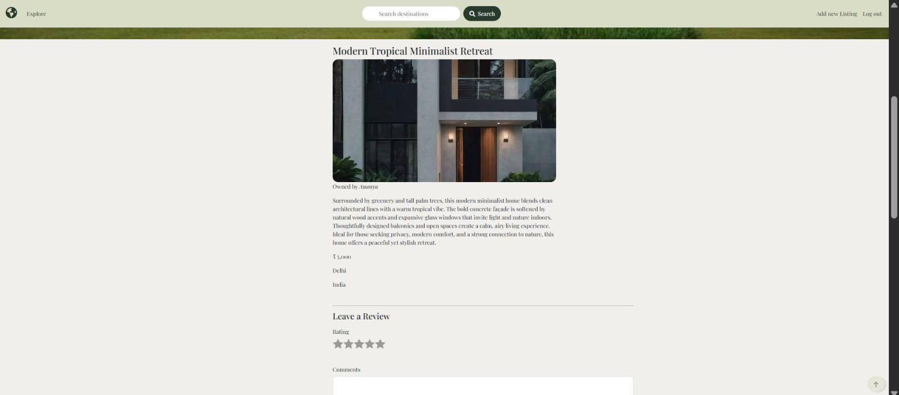
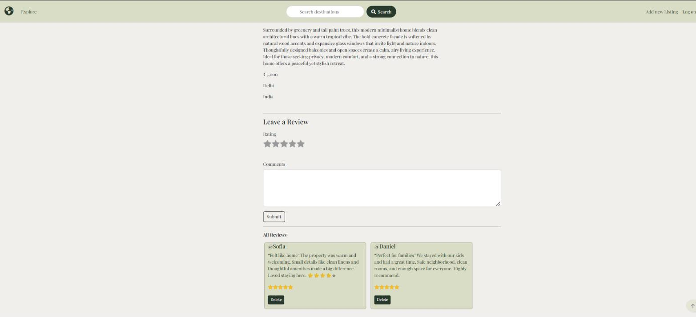
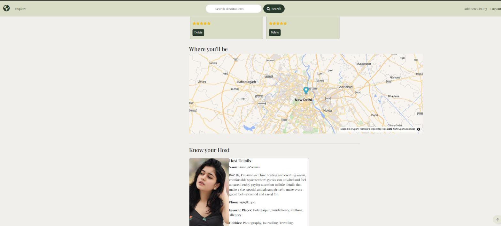
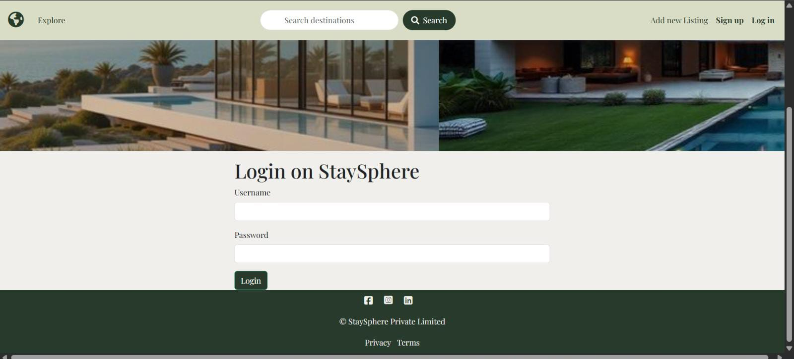
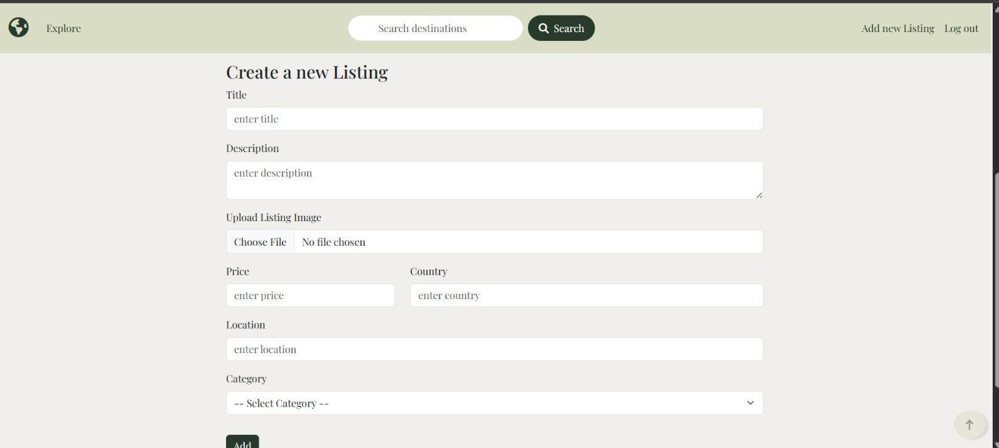

# StaySphere 🏡

StaySphere is a full-stack Airbnb-style property listing and booking app built with Node.js, Express, MongoDB, and EJS. It lets users browse stays, search and filter by category, view listings on a map, leave reviews, and add their own property listings — complete with host profiles.

**🔗 Live demo:** [stay-sphere-green.vercel.app/listings](https://stay-sphere-green.vercel.app/listings)

---

## Screenshots

**Explore page** — browse listings by category (Trending, Iconic Cities, Rooms, Mountains, Castles, Beaches, Awesome Pools, Camping, Arctic)



**Listings grid** with pricing shown per night



**Listing details** — description, price, and location



**Reviews** — logged-in users can leave a star rating and comment



**Interactive map** ("Where you'll be") and a **host profile card** with bio, hobbies, and favorite places



**Login** page



**Add a new listing** — hosts can upload an image, set price, location, country, and category



---

## Features

- 🔍 **Search & category filters** — search listings by title, location, description, or country, or browse by category (beaches, mountains, castles, etc.)
- 🗺️ **Map view** — every listing shows its location on an interactive map, geocoded automatically from the address using the OpenWeather Geocoding API
- ⭐ **Reviews & ratings** — logged-in users can leave a star rating and comment on any listing, and delete their own reviews
- 🖼️ **Image uploads** — listing photos are uploaded and served via Cloudinary
- 👤 **Authentication** — sign up / log in with Passport.js (local strategy), sessions persisted in MongoDB
- 🏠 **Host profiles** — every listing is linked to a host with their own bio, phone number, hobbies, and favorite places
- ➕ **Full CRUD on listings** — create, edit, and delete your own listings (with ownership checks so you can only edit/delete what you own)
- 💰 **Tax toggle** — option to display the total price after taxes
- ✅ **Listing moderation flow** — new listings stay inactive until host info is added, then go live in the public feed
- 🧹 **Data cleanup on delete** — deleting a listing also cleans up its reviews and, if it was their last listing, the host record

---

## Tech stack

| Layer            | Tech |
|-------------------|------|
| Runtime            | Node.js |
| Server framework   | Express 5 |
| Templating         | EJS + ejs-mate |
| Database           | MongoDB + Mongoose |
| Auth               | Passport.js (passport-local, passport-local-mongoose) |
| Sessions           | express-session + connect-mongo |
| File uploads       | Multer + Cloudinary (multer-storage-cloudinary) |
| Validation         | Joi |
| Geocoding          | OpenWeather Geocoding API |
| Maps               | MapLibre / OpenFreeMap |
| Deployment         | Vercel (frontend/app) |

---

## Getting started locally

### Prerequisites

- Node.js (v22+ recommended)
- A MongoDB instance (local or MongoDB Atlas)
- A free [Cloudinary](https://cloudinary.com/) account for image storage
- A free [OpenWeather](https://openweathermap.org/api) API key for geocoding

### Setup

1. Clone the repo
   ```bash
   git clone https://github.com/<your-username>/StaySphere.git
   cd StaySphere
   ```

2. Install dependencies
   ```bash
   npm install
   ```

3. Create a `.env` file in the project root with the following variables:
   ```env
   ATLASDB_URL=your_mongodb_connection_string
   CLOUD_NAME=your_cloudinary_cloud_name
   CLOUD_API_KEY=your_cloudinary_api_key
   CLOUD_API_SECRET=your_cloudinary_api_secret
   OPENWEATHER_KEY=your_openweather_api_key
   SECRET=any_random_session_secret
   NODE_ENV=development
   ```

4. Seed the database with sample listings (optional)
   ```bash
   node init/index.js
   ```

5. Start the server
   ```bash
   npm run dev
   ```

6. Open [http://localhost:8080](http://localhost:8080) in your browser

---

## Project structure

```
StaySphere/
├── app.js                 # App entry point
├── controllers/           # Route logic (listings, users, reviews, hosts, pages)
├── routes/                # Express routers
├── models/                # Mongoose schemas (Listing, User, Review, Host)
├── middleware.js          # Auth & validation middleware
├── cloudConfig.js         # Cloudinary + Multer storage config
├── views/                 # EJS templates
├── public/                # Static assets (css, js, images)
├── init/                  # Database seed script
└── utils/                 # Helper classes (error handling, async wrapper)
```

---

## Contributing

Found a bug or have an idea for a feature? Feel free to open an issue or submit a pull request.

## License

This project is open source and available under the [ISC License](https://opensource.org/license/isc-license-txt).